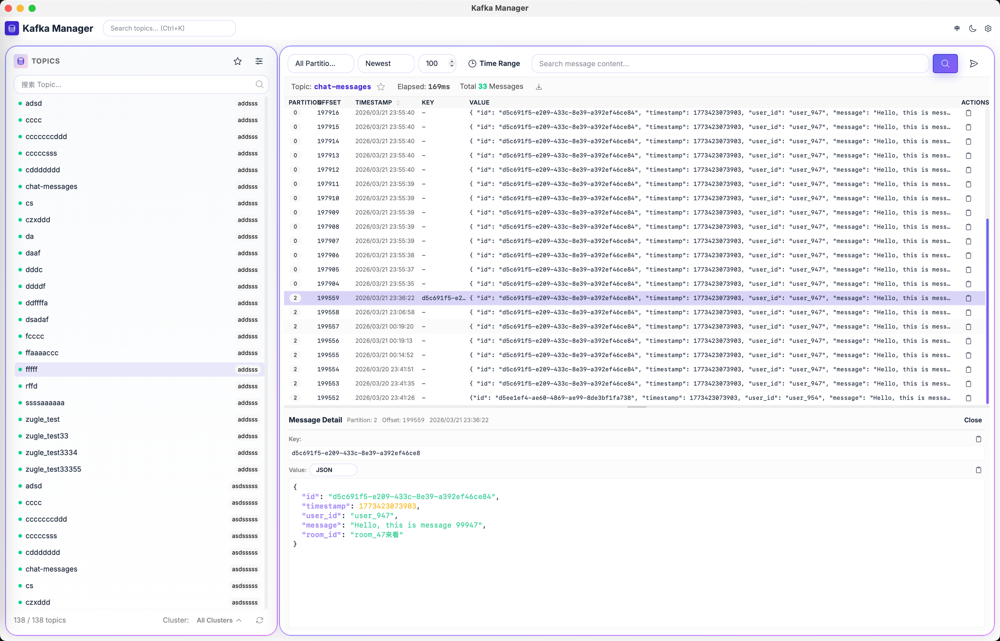

# Kafka Manager

[](https://www.rust-lang.org/)
[](https://vuejs.org/)
[](https://tauri.app/)
[](LICENSE)

**[English](README.md)** | **[中文文档](README-cn.md)**

跨平台桌面 Kafka 查询与管理工具。专为需要快速、直观地访问 Kafka 消息、消费者组和集群内部状态的开发者与数据工程师设计——无需命令行。



## 主要功能

### 消息查询与浏览

- 跨任意分区查询消息，支持最新消息优先或最旧消息优先
- 关键词搜索消息内容，实时过滤
- 时间范围过滤——通过起止时间戳精确定位消息，或使用快捷预设（5 分钟、15 分钟、1 小时、1 天）
- 实时流式消息查询，渐进式渲染，支持随时停止（通过 Tauri IPC Channel 推送）
- 多格式消息查看器：**JSON**（支持语法高亮和自定义主题）、**原始文本**、**十六进制转储**
- 消息列表支持自定义列宽与时间戳排序
- 查询结果导出为 **JSON**、**CSV** 或 **TXT**
- 向任意主题发送消息，支持自定义分区和 Key
- 发送消息历史记录，支持重新发送

### 集群管理

- 多集群支持，分组组织，横向可滚动的分组选择器
- 树形导航器：集群 → 主题 → 分区，可折叠层级结构
- 实时连接健康状态监控与状态指示
- 一键重连 / 断开集群
- Broker 信息展示
- 浏览历史——快速回访最近查看的主题

### 主题管理

- 创建主题，可配置分区数、副本因子和保留策略
- 删除主题（带确认提示）
- 分区详情视图，展示 Leader 与副本分布
- 主题模板，一键重复创建
- 主题收藏，支持命名分组
- 主题变更历史追踪
- 主题级消费者组概览

### 消费者组

- 浏览所有消费者组，查看状态与成员数
- 逐分区详情：起始偏移、结束偏移、已提交偏移和积压量（Lag）
- 逐分区最后提交时间追踪
- 重置消费者组偏移到 **最早**、**最新** 或 **指定时间戳**
- 删除消费者组
- 查看特定主题关联的消费者组

### Schema Registry

- 按集群连接 Schema Registry
- 浏览和查看 Avro / Protobuf Schema
- 查看 Schema 版本与详情

### 桌面应用体验

- 自动更新，支持断点续传与进度显示
- 系统托盘后台运行——不打扰你的工作
- 单实例模式
- 应用日志查看器
- 数据导入/导出，方便在设备间迁移设置
- 深色 / 浅色主题切换
- 中英文双语界面
- 新用户引导教程

## 快速开始

前置条件：安装 [Tauri 依赖](https://tauri.app/start/prerequisites/)

```bash
# 克隆仓库
git clone <repo-url>
cd kafka-manager

# 安装前端依赖
cd ui && npm install

# 开发模式（热重载）
npm run tauri dev
# 或在仓库根目录执行：./start-tauri-dev.sh

# 生产构建
npm run build
npm run tauri build
```

构建的安装包位于 `src-tauri/target/release/bundle/`。

## 配置

集群通过界面在运行时直接添加和管理。也可以在可执行文件旁放置可选的 `config.toml` 预置集群和连接池参数。

## 架构

本应用是完全自包含的 Tauri 2 桌面应用——**没有 HTTP 服务器**。Vue 前端完全通过 **Tauri IPC** 与 Rust 核心通信：

- **统一分发器**：所有业务操作经过一个 `api_request` 命令（约 113 个方法：集群、主题、消费组、消息、Schema Registry、收藏、设置等）
- **流式传输**：消息查询通过 Tauri `Channel` 推送事件，支持协作式取消（`cancel_message_list`）
- **持久化**：SQLite（sqlx，WAL 模式）存储在系统数据目录；Topic/消费组元数据本地缓存，导航秒开

详见文档：

- [架构设计](docs/architecture-cn.md)（[English](docs/architecture.md)）
- [IPC API 参考](docs/api-cn.md)（[English](docs/api.md)）

## 技术栈

### 后端

| 技术 | 用途 |
|------|------|
| [Rust](https://www.rust-lang.org/) | 核心语言 |
| [Tauri 2](https://tauri.app/) | 桌面壳与 IPC 桥接 |
| [Tokio](https://tokio.rs/) | 异步运行时 |
| [SQLx](https://github.com/launchbadge/sqlx) 0.8 | 异步 SQLite 本地持久化 |
| [rdkafka](https://github.com/fede1024/rust-rdkafka) 0.39 | Kafka 客户端 |
| [deadpool](https://github.com/bikeshedder/deadpool) 0.12 | 连接池 |
| [apache-avro](https://github.com/apache/avro) 0.17 | Avro 编解码 |
| [prost](https://github.com/tokio-rs/prost) 0.12 | Protobuf 编解码 |

### 前端

| 技术 | 用途 |
|------|------|
| [Vue 3](https://vuejs.org/) + TypeScript | 前端框架 |
| [Tailwind CSS 4](https://tailwindcss.com/) | 原子化 CSS |
| [DaisyUI 5](https://daisyui.com/) | 组件库 |
| [Pinia](https://pinia.vuejs.org/) | 状态管理 |
| [vue-virtual-scroller](https://github.com/Akryum/vue-virtual-scroller) | 大列表渲染 |
| [Vite](https://vitejs.dev/) 7 | 构建工具 |

## 开发

```bash
# 构建前端
cd ui && npm run build

# 构建 workspace（核心库 + Tauri 壳）
cargo build --release

# 运行测试
cargo test

# 代码检查与格式化
cargo clippy
cargo fmt
```

## License

MIT License
